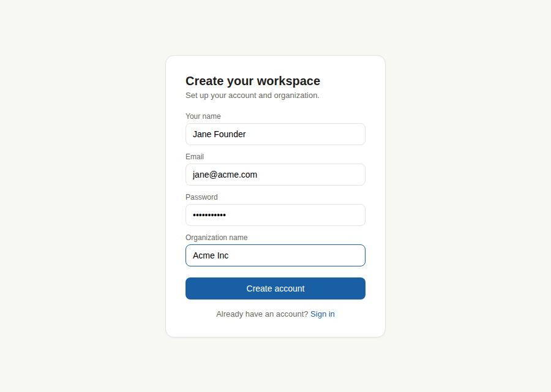
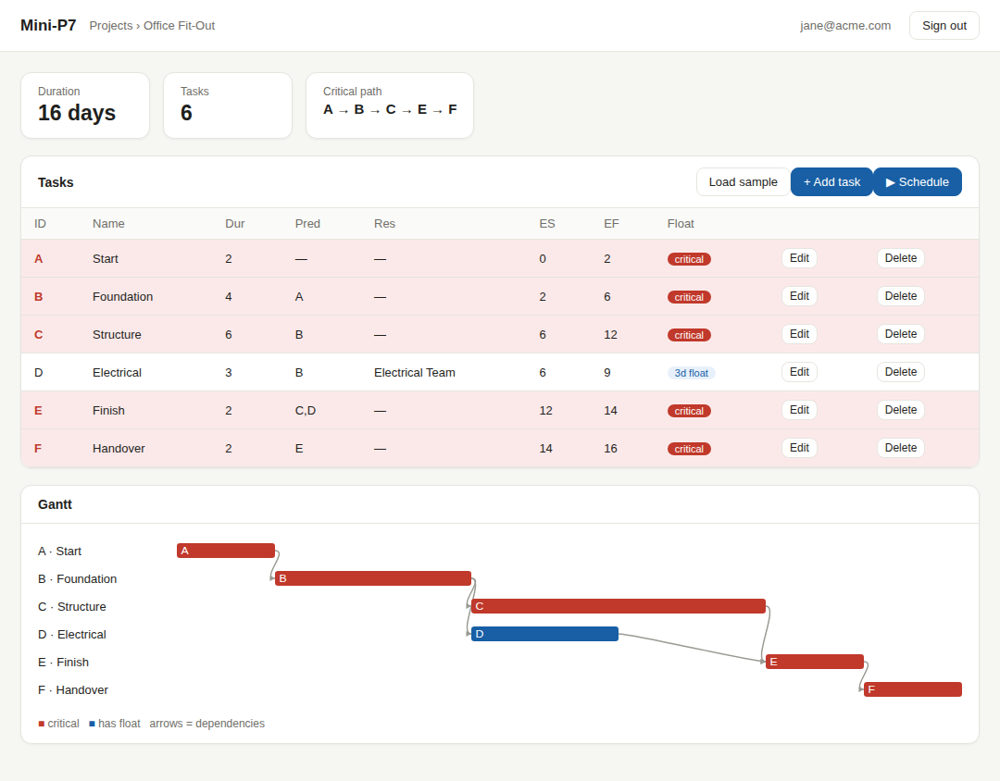

# Mini-P7

**A self-hosted, multi-tenant project scheduler for small teams** — built on a
clean Critical Path Method engine, a disciplined *commons* architecture, and
documentation treated as a first-class product.

Plan a project, break it into tasks, declare which task depends on which, and
instantly see how long the whole thing takes and which tasks are critical — the
ones that can't slip without delaying everything.

---

## Screenshots

Sign up and create your workspace:



The scheduler — critical path highlighted in red, with a live Gantt:



---

## Why this exists

Most scheduling tools are either overkill (Primavera, MS Project) or too simple
(a shared spreadsheet). Mini-P7 aims at the middle for small businesses and
startups running internal projects: light and clear enough to use daily, but it
genuinely understands dependencies, durations, and the critical path.

It also differs in *how* it's built, which is the point:

- **Commons, not a monolith.** The code is a strict dependency graph of small,
  reusable, independently-versioned packages. A pure scheduling engine sits at
  the bottom and is reused unchanged by the API, the CLI, and the tests.
- **Documentation as a product.** Every package documents its contract, every
  architectural decision is recorded as an ADR, every domain term is defined
  once, and the standards are enforced in review. See
  [docs/DOCUMENTATION_STANDARDS.md](docs/DOCUMENTATION_STANDARDS.md).

---

## Features

- **Critical Path Method engine** — forward/backward pass computing early/late
  start and finish, total and free float, and the critical path. Detects cyclic
  and invalid dependencies.
- **Multi-tenant** — organizations own projects; users belong to organizations
  via memberships with roles (owner / admin / member / viewer). Data is always
  scoped to a tenant, enforced and tested.
- **Self-hosted authentication** — sign-up and login with bcrypt-hashed passwords
  and signed, expiring JWTs. No third-party identity provider.
- **REST API** — FastAPI with auto-generated OpenAPI docs at `/docs`.
- **Zero-build web UI** — a schedule table and Gantt chart served by the API; no
  Node or build step required to run it.

---

## Quick start

Requires Python 3.11+.

```bash
pip install -r requirements.txt
./run.sh          # macOS / Linux
run.bat           # Windows (PowerShell: .\run.bat)
```

Open **http://127.0.0.1:8000**, create an account, and you're scheduling.
Interactive API docs are at **http://127.0.0.1:8000/docs**.

> Set `MINIP7_SECRET` to a strong random value in any real deployment — the
> default signing secret is insecure and for local use only.

---

## Architecture

Dependencies point inward, toward a stable core. The schema and engine never
import the API or UI; everything imports them. This is what makes each layer a
reusable *commons*.

```
apps/            interfaces (consumers — never imported)
  api/           FastAPI server + web UI
  cli/           Typer command line
packages/        the commons (reusable, versioned, documented)
  ui/            design system + Gantt (planned)
  client/        generated typed API client (planned)
  services/      orchestration + tenancy/permission enforcement
  persistence/   storage-agnostic repositories (SQLite adapter; Postgres planned)
  auth/          password hashing + JWT (self-hosted)
  engine/        pure CPM computation — no I/O
  schema/        canonical domain model — the single source of truth
```

Full explanation: [docs/architecture/ARCHITECTURE.md](docs/architecture/ARCHITECTURE.md).
Decision log: [docs/adr/](docs/adr/README.md).

---

## Documentation

Organised by the [Diátaxis](https://diataxis.fr) model:

- **Learn** — [Getting started](docs/guides/getting-started.md),
  [Running the app](docs/guides/running-the-app.md)
- **Reference** — [Commons registry](docs/architecture/commons.md),
  [Glossary](docs/domain/glossary.md), package READMEs
- **Understand** — [Architecture](docs/architecture/ARCHITECTURE.md),
  [How CPM works](docs/domain/cpm.md), the [decision log](docs/adr/README.md)
- **Plan** — [Roadmap](docs/ROADMAP.md),
  [Repository strategy](docs/REPO_STRATEGY.md)

---

## Testing

```bash
PYTHONPATH=packages/schema/src:packages/engine/src:packages/persistence/src:packages/services/src:packages/auth/src \
  python -m pytest packages/engine/tests packages/services/tests packages/auth/tests
```

Coverage includes the CPM math (floats, cycles, parallel paths), tenancy
isolation (one org cannot see another's data), role permissions, and auth
(password hashing, token expiry and tampering).

---

## Status & roadmap

Working today: the engine, schema, persistence, services, auth, and the API +
web UI — multi-tenant and authenticated, with a passing test suite.

Next, in order of getting to real users:

1. A polished React frontend with a custom interactive Gantt
2. Hosting + PostgreSQL + database migrations (a live URL)
3. Onboarding polish and first real teams

Deferred until users ask: earned value, resource levelling, baselines, and
typed relationships (SS/FF/SF) with lag. See [docs/ROADMAP.md](docs/ROADMAP.md).

---

## Contributing

See [CONTRIBUTING.md](CONTRIBUTING.md). In short: documentation ships with code,
the dependency rule is enforced, and decisions are recorded as ADRs.
