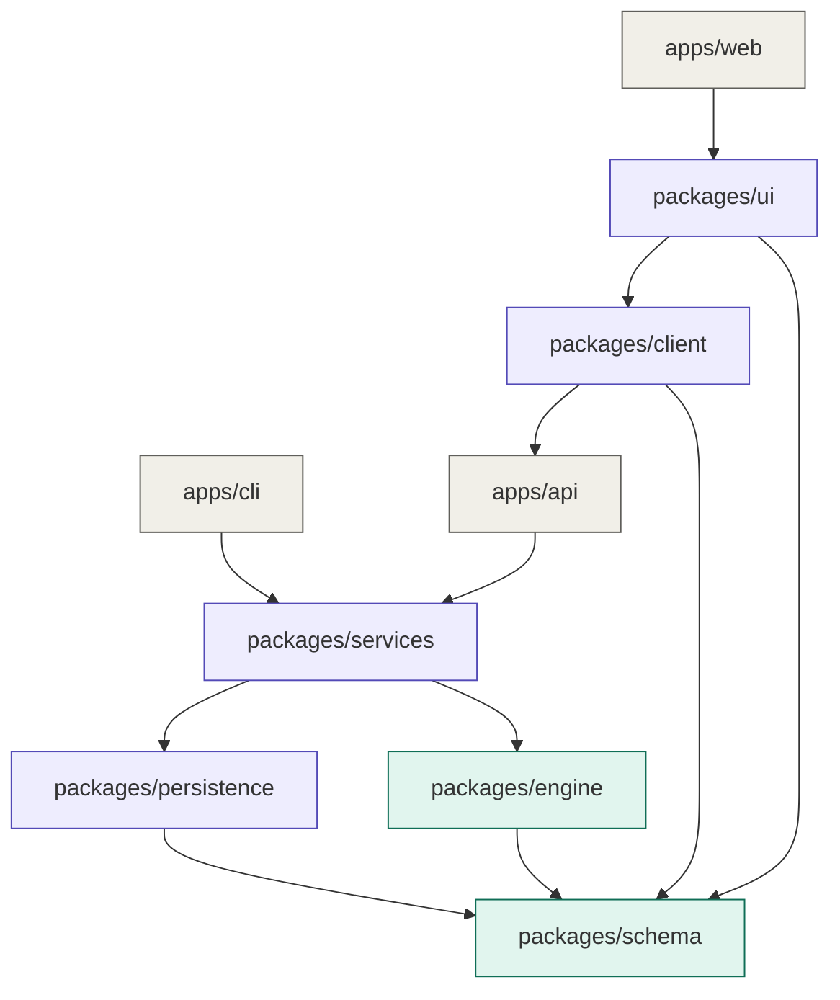

# Architecture

> Category: **Explanation**. This page explains *why* the system is shaped the
> way it is. For *what* each package exposes, see [commons.md](commons.md) and the
> package READMEs.

## First principles

The whole architecture is derived from three things that are irreducibly true of
this domain.

1. **A schedule is a pure function.** Given activities, relationships, calendars,
   and a data date, the dates, floats, and critical path are fully determined.
   Nothing else can affect the answer. Therefore the computation must depend on
   nothing external — no database, no web framework, no clock, no UI.

2. **The model is the contract.** The instant the frontend and backend disagree
   about what an "activity" or a "relationship" is, every layer above breaks,
   often silently. Therefore there must be exactly one definition of the domain,
   and every other artefact generates from it.

3. **Computation, storage, and transport are independent concerns.** Storage may
   change (SQLite → PostgreSQL); transport may change (CLI → REST → GraphQL); the
   rules of Critical Path Method do not. Therefore these are separate layers that
   can be replaced without touching the core.

## The dependency rule

From those principles follows a single law that governs the entire codebase:

> **Dependencies point inward, toward the stable core. The schema and engine
> never import the API, the persistence layer, or the UI. Everything imports
> them.**

This is hexagonal / clean architecture. It is also what makes each layer a
*reusable commons*: a lower package can be consumed by many higher ones without
knowing they exist. The engine does not care whether it is called by the API, the
CLI, or a test — so all three reuse it unchanged.

The rule is made physical by the repository layout: `apps/` may import
`packages/`, `packages/` may import lower `packages/`, and **nothing imports
`apps/`**. A lint rule enforces this and fails CI on violation, so the
architecture cannot quietly erode.

## Stability gradient

Packages are ordered by stability. The lower a package sits, the more depends on
it, and the more reluctant we are to change it (the Stable Dependencies
Principle). The schema and engine change rarely and only with great care; the
feature verticals at the top change constantly. This is deliberate: volatility
lives at the edges, certainty at the core.

Every arrow means "depends on". Notice they all converge on `schema`, and nothing
flows back out to the apps. That convergence is the reuse.

## The rule for feature verticals

When the feature work begins (Schedule, Resources, Costs, Dashboard…), one
additional rule applies:

> **No vertical may import another vertical.** Shared needs move *down* into a
> commons (the engine, the UI library), never *sideways* between features.

This single constraint is what prevents the feature spaghetti that these
applications usually rot into. If two features need the same earned-value
calculation, that calculation belongs in the engine, not copied into both.

## Consequences

- The engine is testable with plain unit tests and property-based tests, with no
  database or server in sight.
- Storage and transport are swappable adapters behind interfaces.
- A breaking change to the schema is a single, reviewable, atomic event that CI
  validates across every consumer at once (the payoff of the monorepo — see
  [ADR-0001](../adr/0001-monorepo.md)).
- Each phase of delivery ships a usable commons, so the project is demoable at
  every step rather than only at the end. See [ROADMAP.md](../ROADMAP.md).
